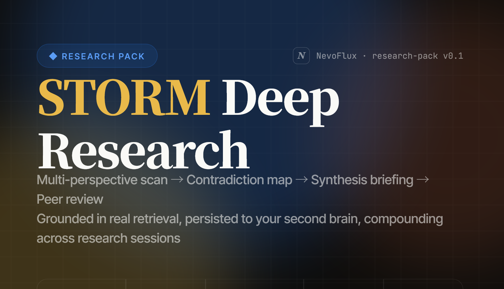

# deep-research

**English** · [中文](README.zh.md)



A NevoFlux pack for **STORM / Co-STORM deep research**. It turns an open-ended question into a
multi-perspective, contradiction-aware, peer-reviewed briefing — grounded in real web sources and
**filed into the user's brain (gbrain)** as a linked, reusable research subgraph that compounds
across future research.

## What is STORM?

**STORM** — *Synthesis of Topic Outlines through Retrieval and Multi-perspective Question Asking* —
is a method for researching and writing long-form, Wikipedia-style articles from scratch with LLMs,
introduced by Shao et al. (NAACL 2024, [arXiv:2402.14207](https://arxiv.org/abs/2402.14207)). Its
insight is that the hard part is the **pre-writing research**, so it structures that stage:

1. **Perspective discovery** — find the diverse viewpoints relevant to the topic.
2. **Multi-perspective question asking** — writers embodying each perspective interrogate a topic
   expert, with answers **grounded in retrieved Internet sources**.
3. **Simulated conversations** — those perspective-driven Q&A dialogues accumulate cited information.
4. **Outline → article** — curate the collected information into an outline, then write from it.

STORM outperformed retrieval-augmented baselines on article organization and coverage breadth, but its
authors flagged two weaknesses: **source-bias propagation** and **spurious fact associations**.

This pack adapts STORM's research engine for NevoFlux and tackles those weaknesses head-on: the
five-perspective scan + grounded retrieval are STORM's perspective-guided question asking, while the
**contradiction map** and **adversarial peer review** phases exist specifically to catch source bias
and fact-mismatch. The user-steering checkpoint borrows from the **Co-STORM** follow-up (collaborative
discourse with a human in the loop). The deliverable isn't a Wikipedia article — it's a cited briefing
filed into your second brain.

- **Pack name:** `deep-research` (this directory) · **namespace:** `research` · **skill:** `research`
  (trigger `/research`) · **protocol:** `pack-protocol/0.1`.
- Installed and validated by the `nevoflux` CLI — run **`nevoflux pack validate`** before installing.
- Design rationale and the full decision log live in `nevoflux/docs/research-pack/` (start with
  `storm-pack-DESIGN.md`).

## Prerequisite: the `brain` pack

This pack is **hard-dependent on the `brain` pack** — every phase files pages via gbrain and reads
`skill_read('brain', …)`. There is no manifest-level dependency mechanism in `protocol/0.1`, so the
skill **preflights** at Phase 0: if gbrain tools aren't reachable it stops immediately and tells the
user to install `brain` first. Install `brain` before this pack.

## Structure

```
deep-research/
  pack.toml                              # manifest: [pack] + [components.skills] + [components.protected]
  README.md
  components/skills/research/
    SKILL.md                             # the /research orchestration skill (5-phase STORM pipeline)
    conventions/
      perspectives.md                    # STORM Prompt 1 — the five-perspective scan
      retrieval.md                       # grounding tiers + run-level fetch cap
      contradiction.md                   # STORM Prompt 2 — conflict / gap map
      brief-format.md                    # STORM Prompt 3 — the synthesis briefing
      review-rubric.md                   # STORM Prompt 4 — adversarial peer review
      filing.md                          # gbrain slug scheme, typed links, status gate
```

The skill declares only `tool_search` + `tool_call_dynamic` in `allowed_tools`; it reaches every
gbrain tool, every `browser_*` tool, and `ask_user` at runtime via `tool_call_dynamic` (which has no
mode gate), so it runs the same in Chat, Browser, or Agent mode. Generated pages live under the
`research/` namespace and are marked **protected** (kept on uninstall unless `--purge-data`).

## Pipeline

```
/research <topic>
  0 preflight     require brain; set expectations; create index (status: in_progress)
  scan-1          frame five perspectives to the topic (no retrieval)
   └─ ★ checkpoint  ask_user to add/remove/replace perspectives (never zero)
  scan-2          per perspective: question → web_search/web_fetch (+ gated Tier-2); file pages
  map             contradiction map via gbrain think over the grounded subgraph
  brief           five-part synthesis; verify high-risk claims; main deliverable
  review          adversarial self-review → completion: --about--> edges, status: complete,
                  then a read-only create_artifact snapshot of the brief
```

## v0.1 scope

- **Mode-agnostic**; default Chat mode. Heavy gated/social crawling (X / 知乎 / 小红书) is smoother
  started in Browser mode, but works in any mode (navigation may prompt for permission). Never logs in
  for the user — it rides the existing session.
- **Cost guardrail** is structural: ≤4 questions/perspective and ≤~15–20 unique `web_fetch` per run
  (pack config is forbidden in `protocol/0.1`).
- **No dashboard** component; the brief renders to a canvas tab via runtime `create_artifact`. The
  gbrain `brief` page is the single source of truth — the artifact is a one-time read-only view.
- A half-finished run leaves an isolated `status: in_progress` draft that is invisible to compounding;
  re-running the topic overwrites it idempotently.
